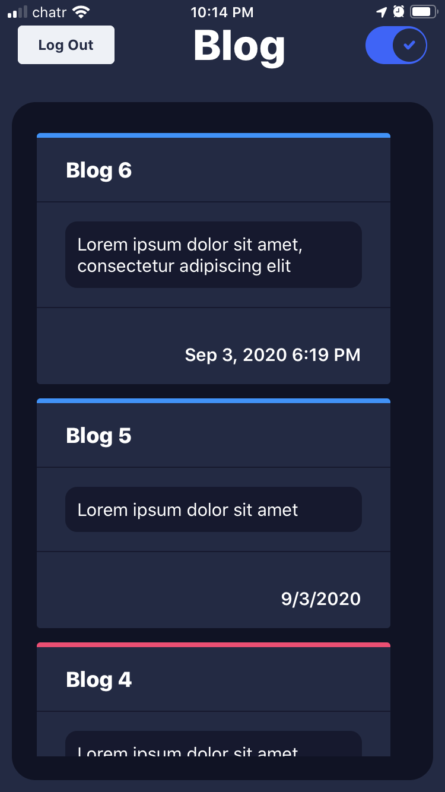
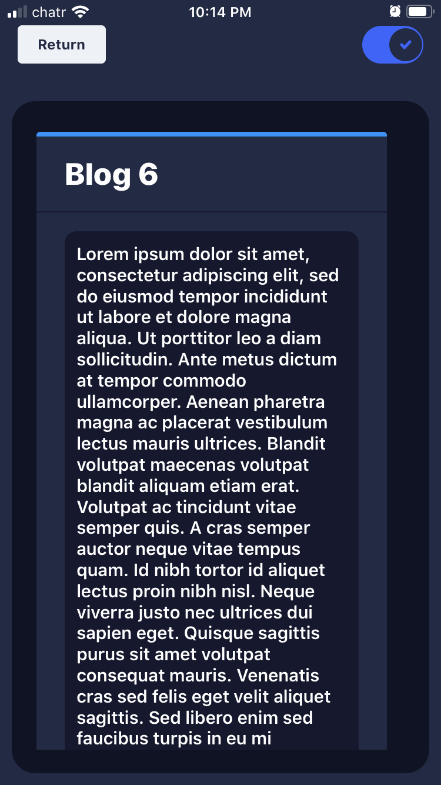
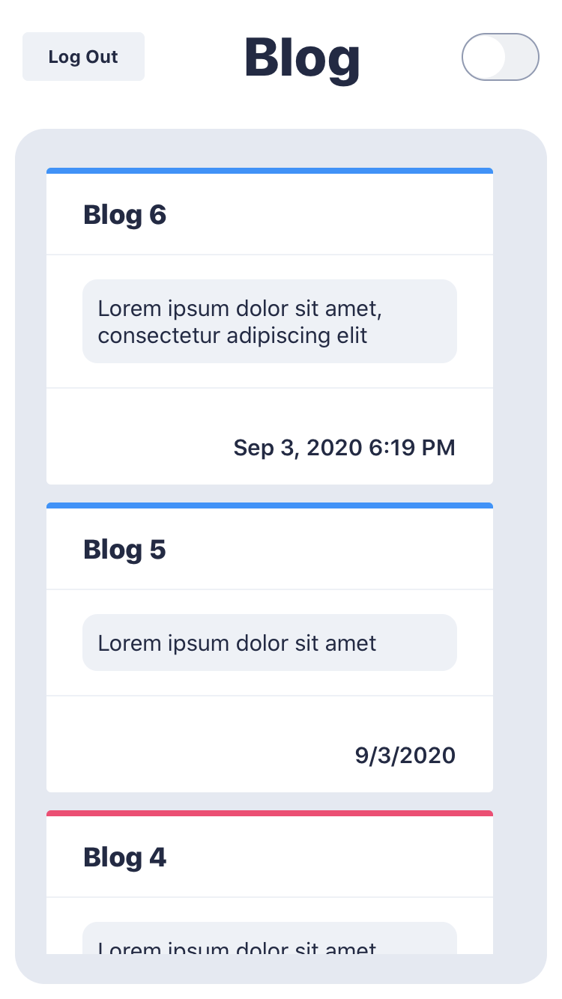
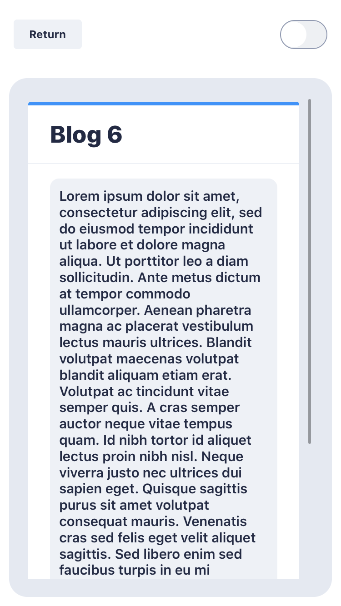

# blog

This project uses React Native as a means to display the contents of a blog and Electron to act as the content managemnet system.
The project also uses Google firebase to authenticate users and Firebase to store all pertinent data.   

> The dashboard of the blog can be found [here](https://github.com/AhmedAlihashi/blog-dashboard/tree/master)

</img>

## Screenshots
<p float="left"> 
   
   
</p>

<p float="left"> 
   
   
</p>


## Quick Instructions

To create a light demo version

```
-git clone https://github.com/AhmedAlihashi/blog.git
-npm install or yarn install
-npm run expo or yarn expo
-from this point you can etiher
> run a simulated instance of an ios or android device and run the app 
or
> download and install the Expo app from the app store and scan the QR code 
```
